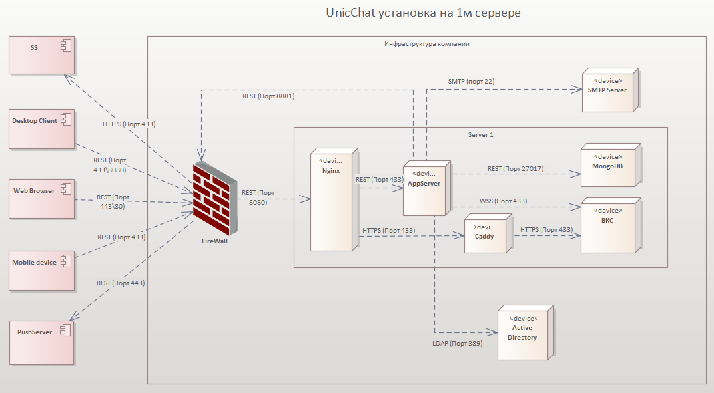

<!-- TOC --><a name="-unicchat"></a>
# Инструкция по установке корпоративного мессенджера для общения и командной работы UnicChat

<!-- TOC --><a name="-6-2170-17"></a>
###### Версия 6-2.1.70, версия документа 1.7
<!-- TOC start (generated with https://github.com/derlin/bitdowntoc) -->

   * [Оглавление](#)
   * [Архитектура установки](#-)
      [Установка на 1-м сервере](#-1-)
      [Установка на 2-x серверах](#-2-x-)
   * [1. Подготовка окружения](#-1--1)
       * [Требования к конфигурации до 50 пользователей. Приложение и БД устанавливаются на 1-й виртуальной машине](#-50-1-)
  
         * [Конфигурация виртуальной машины](#--1)
  
         * [Требования для установки](#--2)
   * [2. Установка UnicChat](#-2-unicchat)
     * [2.1 Скачайте скрипт unicchat.sh](#21-unicchatsh)
     * [2.2. Переключитесь на root-пользователя](#22-root-)
     * [2.3. Дайте скрипту права на выполнение](#23-)
     * [2.4. Запустите скрипт установки](#24-)
     * [2.5. Выполните шаги в меню](#25-)
     * [Важные примечания](#--3)
     * [Устранение проблем](#--4)
   * [3. Создание пользователя-администратора](#-3-)
   * [4. Карта сетевых взаимодействий сервера](#-4-)
         - [Входящие соединения на стороне сервера UnicChat:](#-unicchat-1)
         - [Исходящие соединения на стороне сервера UnicChat:](#-unicchat-2)
   * [Частые проблемы при установке](#--5)
   * [Клиентские приложения](#--6)

<!-- TOC end -->


<!-- TOC --><a name=""></a>
## Оглавление
<!-- TOC -->

<!-- TOC -->

<!-- TOC --><a name="-"></a>
## Архитектура установки

<!-- TOC --><a name="-1-"></a>
#### Установка на 1-м сервере

<!-- TOC --><a name="-2-x-"></a>
#### Установка на 2-x серверах


<!-- TOC --><a name="-1--1"></a>
## 1. Подготовка окружения

<!-- TOC --><a name="-50-1-"></a>
#### Требования к конфигурации до 50 пользователей. Приложение и БД устанавливаются на 1-й виртуальной машине

<!-- TOC --><a name="--1"></a>
##### Конфигурация виртуальной машины
```
CPU 4 cores 1.7ghz, с набором инструкций FMA3, SSE4.2, AVX 2.0;
RAM 16 Gb;
250 Gb HDD\SSD;
```
Для ОС Ubuntu 20+ предлагаем воспользоваться нашими краткими инструкциями. Для других ОС воспользуйтесь инструкциями, размещенными в сети Интернет.
<!-- TOC --><a name="--2"></a>
##### Требования для установки
- Сервер на Linux (рекомендуется Ubuntu 20+/Debian)
- Доступ с правами root или через sudo
- Доменное имя, привязанное к IP-адресу вашего сервера

<!-- TOC --><a name="-2-unicchat"></a>
## 2. Установка UnicChat

<!-- TOC --><a name="21-unicchatsh"></a>
### 2.1 Скачайте скрипт unicchat.sh
<!-- TOC --><a name="22-root-"></a>
### 2.2. Переключитесь на root-пользователя
```bash
sudo su
```

<!-- TOC --><a name="23-"></a>
### 2.3. Дайте скрипту права на выполнение
```bash
chmod +x unicchat.sh
```

<!-- TOC --><a name="24-"></a>
### 2.4. Запустите скрипт установки
```bash
./unicchat.sh
```

<!-- TOC --><a name="25-"></a>
### 2.5. Выполните шаги в меню

Можете выбрать полностью автоматизированную установку 9️⃣9️⃣

| Шаг | Действие | Описание |
|-----|----------|----------|
| 1️⃣ | Установка зависимостей | Docker, docker-compose, Nginx, Certbot, Git |
| 2️⃣ | Клонирование репозитория | Загрузка исходного кода UnicChat |
| 3️⃣ | Проверка AVX | Определение совместимой версии MongoDB |
| 4️⃣ | Настройка домена | Конфигурация доменного имени и проверка DNS |
| 5️⃣ | Генерация конфига Nginx | Создание конфигурации веб-сервера |
| 6️⃣ | Применение конфига Nginx | Установка сгенерированной конфигурации |
| 7️⃣ | Настройка SSL | Получение сертификата Let's Encrypt |
| 8️⃣ | Активация Nginx | Включение конфигурации сайта |
| 9️⃣ | Подготовка env-файлов | Создание необходимых переменных окружения |
| 🔟 | Аутентификация в Yandex Registry | Вход в реестр контейнеров |
| 1️⃣1️⃣ | Запуск UnicChat | Запуск всех сервисов через Docker |
| 1️⃣2️⃣ | Обновление Site_Url | Настройка MongoDB с правильным доменом |
| 9️⃣9️⃣| Автоматизированная установка | Исполняет все шаги автоматически


<!-- TOC --><a name="--3"></a>
## Важные примечания
- Доменное имя должно иметь A-запись в DNS перед настройкой SSL (Шаг 7)
- Для процессоров без AVX используйте MongoDB 4.4 (Шаг 3)
- После завершения установки UnicChat будет доступен по адресу: `https://ваш-домен`

<!-- TOC --><a name="--4"></a>
## Устранение проблем
- Если скрипт не видит файл `domain.usr.txt`, проверьте:
  - Файл должен находиться в той же директории, что и скрипт
  - Формат файла: `DOMAIN=ваш-домен` и `EMAIL=ваш-email` на отдельных строках
- Для перезапуска сервисов используйте:
  ```bash
  docker-compose -f unicchat/single-server-install/unicchat.yml restart
  ```
```
> При возникновении проблем проверьте логи Nginx (`/var/log/nginx/error.log`) и Docker (`docker logs <имя_контейнера>`)
```
<!-- TOC --><a name="-3-"></a>
## 3. Создание пользователя-администратора
1. При первом запуске откроется форма создания администратора:
   
   * `Organization ID` - Идентификатор вашей организации, используется для подключения к push-серверу. Для получения ID необходимо написать запрос с указанием значения в Organization Name на почту support@unic.chat;
   * `Full name` - Имя пользователя, которое будет отображаться в чате;
   * `Username` - Логин пользователя, который вы будете указывать для авторизации;
   * `Email` - Действующая почта, используется для восстановления доступа;
   * `Password` - Пароль вашего пользователя;
   * `Confirm your password` - Подтверждение пароля;
2. После создания пользователя авторизуйтесь в веб-интерфейсе с использованием ранее указанных параметров.
3. Для включения пушей перейдите в раздел Администрирование - Push. Включите использование шлюза и укажите адрес шлюза `https://push1.unic.chat`.
4. Перейдите в раздел Администрирование - Organization, убедитесь, что поля заполнены в соответствии с п.1.
5. Настройка завершена.

<!-- TOC --><a name="-4-"></a>
## 4. Карта сетевых взаимодействий сервера

<!-- TOC --><a name="-unicchat-1"></a>
#### Входящие соединения на стороне сервера UnicChat:
Открыть порты:
- 8080/TCP - по умолчанию, сервер запускается на 8080 порту (для внутреннего проксирования через Nginx);
- 8081/TCP - для сервиса `uc.score`;
- 443/TCP - для HTTPS-соединений через Nginx;
- 80/TCP - для перенаправления HTTP-запросов на HTTPS;

<!-- TOC --><a name="-unicchat-2"></a>
#### Исходящие соединения на стороне сервера UnicChat:
* Открыть доступ для Push-шлюза:
  * 443/TCP, на хост `push1.unic.chat`;
* Открыть доступ для ВКС-сервера:
  * 443/TCP, на хост `lk-yc.unic.chat`;
  * 7880/TCP, 7881/TCP, 7882/UDP;
  * 5349/TCP, 3478/UDP;
  * (50000 - 60000)/UDP (диапазон этих портов может быть изменён при развертывании лицензионной версии непосредственно владельцем лицензии);
* Открыть доступ до внутренних ресурсов: LDAP, SMTP, DNS при необходимости использования этого функционала.

<!-- TOC --><a name="--5"></a>
## Частые проблемы при установке
Раздел в наполнении.

<!-- TOC --><a name="--6"></a>
## Клиентские приложения
* [Репозитории клиентских приложений]
* Android: (https://play.google.com/store/apps/details?id=pro.unicomm.unic.chat&pcampaignid=web_share)
* iOS: (https://apps.apple.com/ru/app/unicchat/id1665533885)
* Desktop: (https://github.com/unicommorg/unic.chat.desktop.releases/releases)
