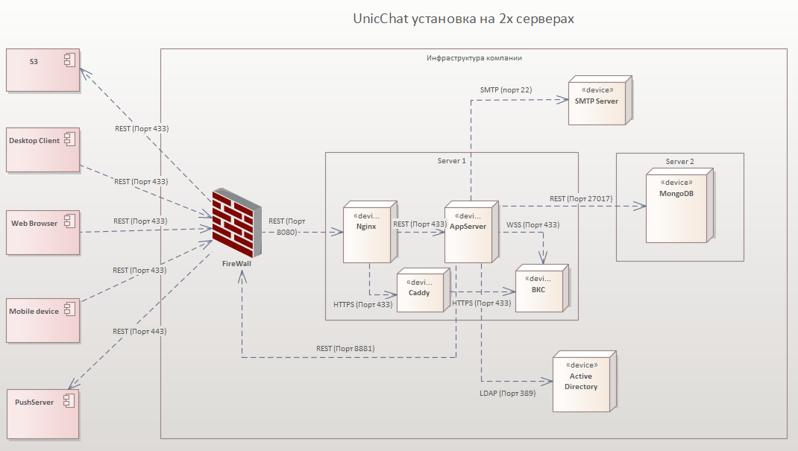
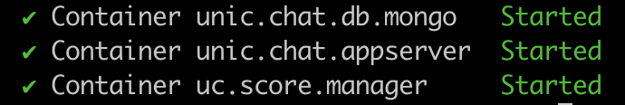
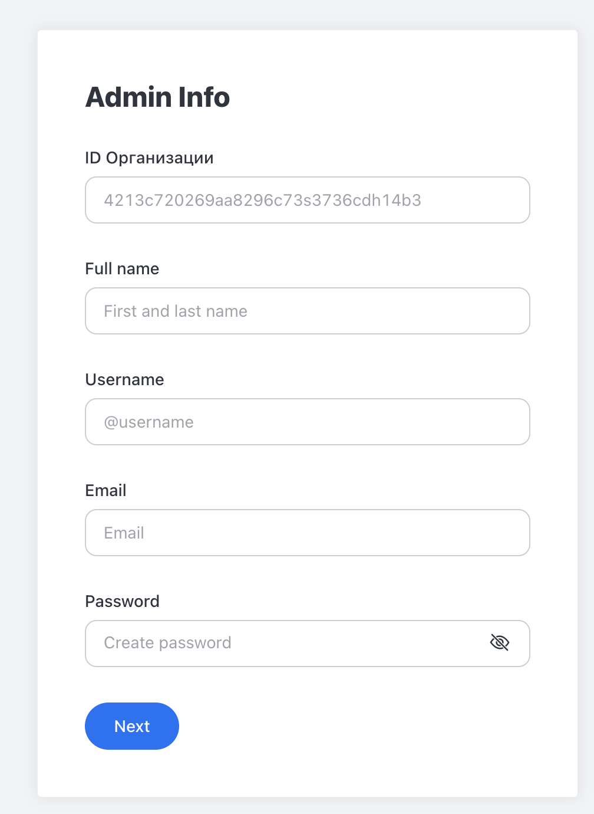

<!-- TOC --><a name="-unicchat"></a>
# Инструкция по установке корпоративного мессенджера для общения и командной работы UnicChat

<!-- TOC --><a name="-6-2170-17"></a>
###### Версия 6-2.1.70, версия документа 1.7
<!-- TOC start (generated with https://github.com/derlin/bitdowntoc) -->

   * [Оглавление](#)
   * [Архитектура установки](#-)
         - [Установка на 1-м сервере](#-1-)
   * [Шаг 1. Подготовка окружения](#-1--1)
     * [Требования к конфигурации до 50 пользователей. Приложение и БД устанавливаются на 1-й виртуальной машине](#-50-1-)
     * [Конфигурация виртуальной машины](#--1)
     * [Рекоменндуемые компоненты для установки ](#--2)
   * [Шаг 2. Внешние зависимости](#-2-)
   * [Шаг 3. Клонирование репозитория](#-3-)
   * [Шаг 4. Проверка версии MongoDB](#-4-mongodb)
   * [Шаг 5. Настройка HTTPS](#-5-https)
   * [Шаг 6. Запуск UnicChat](#-6-unicchat)
   * [Шаг 7. Обновление настроек MongoDB](#-7-mongodb)
   * [Шаг 8. Создание пользователя-администратора](#-8-)
   * [Шаг 9. Карта сетевых взаимодействий сервера](#-9-)
         - [Входящие соединения на стороне сервера UnicChat:](#-unicchat-1)
         - [Исходящие соединения на стороне сервера UnicChat:](#-unicchat-2)
   * [Частые проблемы при установке](#--3)
   * [Клиентские приложения](#--4)

<!-- TOC end -->


<!-- TOC --><a name=""></a>
## Оглавление
<!-- TOC -->

<!-- TOC -->

<!-- TOC --><a name="-"></a>
## Архитектура установки

<!-- TOC --><a name="-1-"></a>
#### Установка на 1-м сервере


<!-- TOC --><a name="-1--1"></a>
## Шаг 1. Подготовка окружения

<!-- TOC --><a name="-50-1-"></a>
#### Требования к конфигурации до 50 пользователей. Приложение и БД устанавливаются на 1-й виртуальной машине

<!-- TOC --><a name="--1"></a>
##### Конфигурация виртуальной машины
```
CPU 4 cores 1.7ghz, с набором инструкций FMA3, SSE4.2, AVX 2.0;
RAM 16 Gb;
250 Gb HDD\SSD;
```
Для ОС Ubuntu 20+ предлагаем воспользоваться нашими краткими инструкциями. Для других ОС воспользуйтесь инструкциями, размещенными в сети Интернет.
<!-- TOC --><a name="--2"></a>
##### Рекоменндуемые компоненты для установки 
* ОС: Ubuntu 20+
* Веб-сервер: NGINX
* SSL: Certbot
* Контейнеризация: Docker


<!-- TOC --><a name="-2-"></a>
## Шаг 2. Внешние зависимости
* Установите docker и docker-compose  https://docs.docker.com/engine/install/ubuntu/
* Установите nginx
```shell
sudo apt install nginx
```
Установите certbot и плагин python3-certbot-nginx
```shell
sudo apt install certbot python3-certbot-nginx
```
Установите git
```shell
    sudo apt install git -y
```


<!-- TOC --><a name="-3-"></a>
## Шаг 3. Клонирование репозитория
1. Выполните на сервере:
   ```shell
   git clone https://github.com/unicommorg/unicchat.git
   ```

<!-- TOC --><a name="-4-mongodb"></a>
## Шаг 4. Проверка версии MongoDB
1. На виртуальной машине выполните команду:
   ```shell
   grep avx /proc/cpuinfo
   ```
   или аналогичную для вашей ОС.
2. Если в ответе вы не видите AVX, то в файле `./single_server_install/unicchat.yml` в строке `image: docker.io/bitnami/mongodb:${MONGODB_VERSION:-4.4}` убедитесь, что указана версия MongoDB 4.4.
3. Если AVX поддерживается (в ответе есть строки с поддержкой AVX), то можете поставить версию от 5 и выше.

<!-- TOC --><a name="-5-https"></a>
## Шаг 5. Настройка HTTPS
Пошаговая инструкция по настройке защищенного соединения для вашего сайта.

1. Скопируйте необходимые файлы из папки `./nginx`:

```bash
sudo cp ./nginx/app.unic.chat /etc/nginx/sites-available/
sudo cp ./nginx/options-ssl-nginx.conf /etc/letsencrypt/
```
2. Замена доменного имени
Замените все упоминания app.unic.chat на ваше доменное имя в конфигурационном файле:

``` bash
sudo sed -i 's/app.unic.chat/ваш_домен/g' /etc/nginx/sites-available/app.unic.chat
```
3. Получение SSL-сертификата
Выберите подходящий способ получения сертификата:

Автоматическая настройка (рекомендуется)
```bash
sudo certbot --nginx -d ваш_домен
```
Только получение сертификата
```bash
sudo certbot --certonly -d ваш_домен
```
Сгенерируйте параметры Диффи-Хеллмана для дополнительной безопасности:

```bash
sudo openssl dhparam -out /etc/letsencrypt/ssl-dhparams.pem 2048
```
4. Изменение имени конфигурации nginx
  Измените имя конфигурационного файла на ваше доменное имя:

```bash
sudo mv /etc/nginx/sites-available/app.unic.chat /etc/nginx/sites-available/ваш_домен
```
5. Активация конфигурации

Отключите конфигурацию по умолчанию:

```bash
sudo rm /etc/nginx/sites-enabled/default
```
Включите новую конфигурацию:

```bash
sudo ln -s /etc/nginx/sites-available/ваш_домен /etc/nginx/sites-enabled/
```
Проверьте синтаксис и перезагрузите nginx:

``` bash
sudo nginx -t && sudo systemctl reload nginx
```

<!-- TOC --><a name="-6-unicchat"></a>
## Шаг 6. Запуск UnicChat
1. Подготовка конфигурации
Перейдите в директорию single_server_install
``` shell
cd single_server_install
```
2. Отредактируйте основной конфиг:
```bash
nano config.sh
```
Параметры для изменения(можно оставить значения по умолчанию):

```bash
MONGODB_ROOT_PASSWORD="надежный_пароль_для_root"
MONGODB_USERNAME="ваш_уникальный_логин" 
MONGODB_PASSWORD="сложный_пароль_админа"
MONGODB_DATABASE="название_базы_данных"
```
Создание файлов окружения
```bash
chmod +x generate_env_files.sh
./generate_env_files.sh
```
Будут созданы 3 файла:

* mongo.env - настройки MongoDB

* appserver.env - конфиг основного сервера

 solid.env - параметры Solid-компонента

Запуск системы
Авторизация в Yandex Container Registry:

```bash
sudo docker login \
  --username oauth \
  --password y0_AgAAAAB3muX6AATuwQAAAAEawLLRAAB9TQHeGyxGPZXkjVDHF1ZNJcV8UQ \
  cr.yandex
```
Запуск сервисов:

```bash
docker compose -f unicchat.yml up -d
```
Управление сервисом
Проверка логов:
```bash
docker logs unic.chat.appserver -f
```
Остановка системы:

```bash
docker compose -f unicchat.yml down
```
Важные заметки
Безопасность:
```bash
chmod 600 *.env  # Ограничиваем доступ к конфигам
```
5. Успешный запуск компонент будет отображаться в терминале:
   


<!-- TOC --><a name="-7-mongodb"></a>
## Шаг 7. Обновление настроек MongoDB
1. Подключитесь к контейнеру MongoDB с использованием root-учетной записи:
   ```shell
   docker exec -it unic.chat.db.mongo mongosh -u root -p rootpass
   ```
2. Перейдите в базу данных `unicchat_db`:
   ```javascript
   use unicchat_db
   ```
3. Выполните команды для обновления настроек `Site_Url`:
   ```javascript
   db.rocketchat_settings.updateOne({"_id":"Site_Url"},{"$set":{"value":"https://ваш_домен"}})
   db.rocketchat_settings.updateOne({"_id":"Site_Url"},{"$set":{"packageValue":"https://ваш_домен"}})
   ```
4. Выйдите из MongoDB:
   ```shell
   exit
   ```
5. UnicChat будет доступен по адресу `https://app.unic.chat`.
<!-- TOC --><a name="-8-"></a>
## Шаг 8. Создание пользователя-администратора
1. При первом запуске откроется форма создания администратора:
   
   * `Organization ID` - Идентификатор вашей организации, используется для подключения к push-серверу. Для получения ID необходимо написать запрос с указанием значения в Organization Name на почту support@unic.chat;
   * `Full name` - Имя пользователя, которое будет отображаться в чате;
   * `Username` - Логин пользователя, который вы будете указывать для авторизации;
   * `Email` - Действующая почта, используется для восстановления доступа;
   * `Password` - Пароль вашего пользователя;
   * `Confirm your password` - Подтверждение пароля;
2. После создания пользователя авторизуйтесь в веб-интерфейсе с использованием ранее указанных параметров.
3. Для включения пушей перейдите в раздел Администрирование - Push. Включите использование шлюза и укажите адрес шлюза `https://push1.unic.chat`.
4. Перейдите в раздел Администрирование - Organization, убедитесь, что поля заполнены в соответствии с п.1.
5. Настройка завершена.

<!-- TOC --><a name="-9-"></a>
## Шаг 9. Карта сетевых взаимодействий сервера

<!-- TOC --><a name="-unicchat-1"></a>
#### Входящие соединения на стороне сервера UnicChat:
Открыть порты:
- 8080/TCP - по умолчанию, сервер запускается на 8080 порту (для внутреннего проксирования через Nginx);
- 8081/TCP - для сервиса `uc.score`;
- 443/TCP - для HTTPS-соединений через Nginx;
- 80/TCP - для перенаправления HTTP-запросов на HTTPS;

<!-- TOC --><a name="-unicchat-2"></a>
#### Исходящие соединения на стороне сервера UnicChat:
* Открыть доступ для Push-шлюза:
  * 443/TCP, на хост `push1.unic.chat`;
* Открыть доступ для ВКС-сервера:
  * 443/TCP, на хост `lk-yc.unic.chat`;
  * 7880/TCP, 7881/TCP, 7882/UDP;
  * 5349/TCP, 3478/UDP;
  * (50000 - 60000)/UDP (диапазон этих портов может быть изменён при развертывании лицензионной версии непосредственно владельцем лицензии);
* Открыть доступ до внутренних ресурсов: LDAP, SMTP, DNS при необходимости использования этого функционала.

<!-- TOC --><a name="--3"></a>
## Частые проблемы при установке
Раздел в наполнении.

<!-- TOC --><a name="--4"></a>
## Клиентские приложения
* [Репозитории клиентских приложений]
* Android: (https://play.google.com/store/apps/details?id=pro.unicomm.unic.chat&pcampaignid=web_share)
* iOS: (https://apps.apple.com/ru/app/unicchat/id1665533885)
* Desktop: (https://github.com/unicommorg/unic.chat.desktop.releases/releases)
