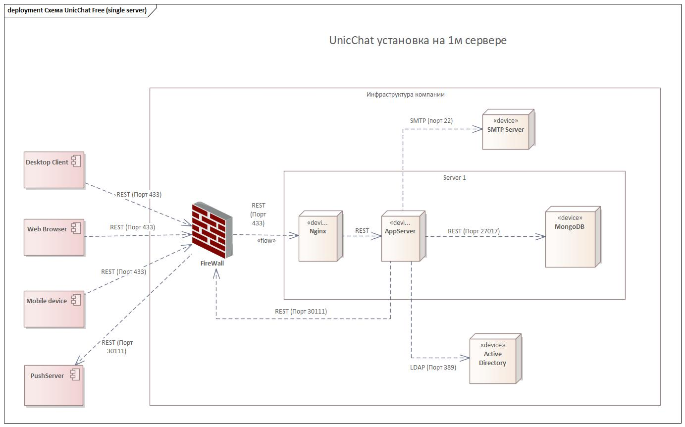
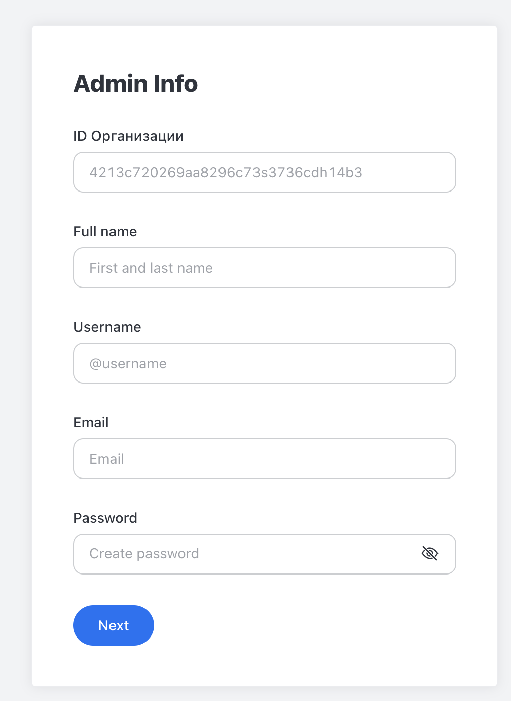

# Инструкция по установке корпоративного мессенджера для общения и командной работы UnicChat

Инструкция описывает установку базовой редакции UnicChat на один сервер. Установка выполняется одним `docker compose` — без скриптов: пользователи БД, секрет Vault и настройка адреса сайта создаются init-контейнерами при первом запуске.

## Содержание

- [Состав продукта](#--)
- [Архитектура установки](#---1)
- [Обязательные компоненты](#----1)
- [Опциональные компоненты](#----2)
- [Шаг 1. Подготовка окружения](#--1-)
  - [1.1 Требования к конфигурации](#11-)
  - [1.2 Клонирование репозитория](#12-)
- [Шаг 2. Установка UnicChat](#--2-unicchat)
  - [2.1 Права и доступы, которые нужно выдать](#21-)
  - [2.2 Установите Docker](#22-docker)
  - [2.3 Проверка поддержки AVX процессором](#23-avx-)
  - [2.4 Авторизация в Container Registry](#24-container-registry)
  - [2.5 Файл .env](#25-env)
  - [2.6 Запуск](#26-)
  - [2.7 Проверка](#27-)
  - [2.8 Открытие сетевых доступов и портов](#28-)
- [Шаг 3. Создание пользователя-администратора](#--3-)
- [Шаг 4. Настройка push-уведомлений](#--4-push-)
- [Nginx и SSL для production](#nginx--ssl-production)
- [Управление установкой](#-)
- [Частые проблемы при установке](#---1)
- [Описание процесса установки технически](#----2)
- [Клиентские приложения](#---2)

<!-- TOC --><a name="--"></a>
## Состав продукта

Базовая редакция UnicChat включает:

| Компонент | Назначение |
|-----------|------------|
| AppServer | Сервер мессенджера: веб-интерфейс, API, WebSocket |
| MongoDB | Основная база данных приложения, Vault и Tasker |
| Vault | Хранилище секретов и файловых ключей |
| Logger | Журналирование событий (хранилище — PostgreSQL) |
| Tasker | Сервис задач (база знаний задач) |

Расширенные компоненты — MinIO, совместное редактирование документов (DocumentServer), бот Redmine — входят в редакцию [unicchat.enterprise](https://github.com/unicommorg/unicchat.enterprise).

<!-- TOC --><a name="---1"></a>
## Архитектура установки

Все сервисы базовой редакции устанавливаются на один сервер.



<!-- TOC --><a name="----1"></a>
## Обязательные компоненты

#### Push-шлюз

Шлюз Unicomm отправляет push-уведомления на телефоны iOS и Android. С сервера UnicChat откройте исходящий 443/TCP на `push1.unic.chat`. Входящие порты для этого шлюза не открывайте.

#### ВКС-шлюз

Шлюз Unicomm обеспечивает аудио- и видеозвонки. С сервера UnicChat откройте исходящие порты на `lk-yc.unic.chat` — список в п. 2.8. Входящие порты для внешнего шлюза не открывайте.

#### Приложения UnicChat

Пользовательское приложение на iOS и Android. Основное взаимодействие — по HTTPS (443/TCP) или, в тестовом контуре, по HTTP до порта приложения. Для звонков медиа-трафик идёт через ВКС-шлюз, а не напрямую на сервер UnicChat.

<!-- TOC --><a name="----2"></a>
## Опциональные компоненты

#### SMTP-сервер

Отправка OTP-кодов, восстановление пароля, напоминания о пропущенных сообщениях. Предоставляется вами — подойдёт как публичный, так и корпоративный сервер. **Интеграция с SMTP не обязательна.**

#### LDAP-сервер

Получение списка пользователей из каталога. UnicChat может обслуживать и пользователей из LDAP, и внутренних пользователей собственной базы. **Интеграция с LDAP не обязательна.**

<!-- TOC --><a name="--1-"></a>
## Шаг 1. Подготовка окружения

<!-- TOC --><a name="11-"></a>
### 1.1 Требования к конфигурации

Конфигурация виртуальной машины для контура до 50 пользователей (приложение и БД на одной машине):

```text
CPU 4 cores 1.7 GHz, с набором инструкций FMA3, SSE4.2 (AVX 2.0 — для MongoDB 5.x+, см. п. 2.3)
RAM 16 GB
250 GB HDD/SSD
```

Требования к серверу:

- Linux, рекомендуется Ubuntu 20+ / Debian;
- доступ с правами root или через sudo;
- для production — доменное имя с A-записью на IP сервера; для тестового контура достаточно IP сервера в вашей сети.

<!-- TOC --><a name="12-"></a>
### 1.2 Клонирование репозитория

```shell
git clone https://github.com/unicommorg/unicchat.git
```

<!-- TOC --><a name="--2-unicchat"></a>
## Шаг 2. Установка UnicChat

Каталог `single-server-install/`, файл `docker-compose.yml`, один `.env`. Скрипт установки из предыдущих версий удалён: всё, что он делал руками, теперь выполняют сервисы самого compose — сеть, пользователи БД, секрет Vault, адрес сайта создаются автоматически.

<!-- TOC --><a name="21-"></a>
### 2.1 Права и доступы, которые нужно выдать

**На сервере (ОС)**

| Кому | Зачем |
|------|--------|
| Пользователь в группе `sudo` | Установка Docker, настройка firewall |
| Тот же пользователь в группе `docker` | `docker compose` и `docker login` без `sudo` (`sudo usermod -aG docker $USER`, затем перелогин) |
| Запись в каталог установки | `single-server-install/.env` |

**Сеть и DNS**

| Что | Зачем |
|-----|--------|
| A-запись домена на IP сервера | Production-доступ и выпуск SSL (шаг с Nginx) |
| Входящий **8080/tcp** | Веб-интерфейс (без Nginx); с Nginx — только 80/443 |
| Исходящий **443/tcp** на `cr.yandex` | `docker pull` образов |
| Исходящий **443/tcp** на `push1.unic.chat` | Push-уведомления |
| Исходящие порты на `lk-yc.unic.chat` | Звонки через ВКС-шлюз (п. 2.8) |

<!-- TOC --><a name="22-docker"></a>
### 2.2 Установите Docker

Установите Docker Engine и плагин Compose по официальной документации: https://docs.docker.com/engine/install/

```shell
docker --version
docker compose version
sudo systemctl enable --now docker
docker info
```

<!-- TOC --><a name="23-avx-"></a>
### 2.3 Проверка поддержки AVX процессором

В `.env` указан образ MongoDB 4.4 (`IMAGE_MONGODB`). Для него AVX не нужен. Перед сменой образа на MongoDB 5 или новее проверьте процессор:

```shell
grep avx /proc/cpuinfo
```

- Есть строки с `avx` — процессор подойдёт и для MongoDB 5.x+.
- Пустой вывод — оставляйте 4.4, как в `.env` (`IMAGE_MONGODB`).

<!-- TOC --><a name="24-container-registry"></a>
### 2.4 Авторизация в Container Registry

Образы лежат в Yandex Container Registry. Войдите в реестр:

```shell
docker login --username oauth \
  --password-stdin \
  cr.yandex <<< "y0__wgBEPrL67wHGMHdEyD7rJmMGCeDEOXSuqJalbFdb2Dgucs0mlmU"
```

<!-- TOC --><a name="25-env"></a>
### 2.5 Файл `.env`

```shell
cd unicchat/single-server-install
cp .env.example .env
```

Значения `change_me_*` замените своими паролями. Теги образов — переменные `IMAGE_*`.

#### Свои секреты и учётные данные

Задайте **свои** пароли и имена служебных пользователей. Не оставляйте значения из `.env.example` и не используйте одни и те же пароли на разных площадках.

Обязательно замените:

| Переменная | Зачем |
|------------|--------|
| `MONGODB_ROOT_PASSWORD` | root MongoDB |
| `MONGODB_PASSWORD` | пользователь приложения (`MONGODB_USERNAME`) |
| `VAULT_DB_PASSWORD` | БД Vault |
| `TASKER_DB_PASSWORD` | БД Tasker; попадёт в секрет Vault `KBTConfigs` |
| `LOGGER_DB_PASSWORD` | PostgreSQL Logger |

Пример генерации (алфавит совместим с MongoDB URI — только `[A-Za-z0-9_-]`):

```shell
gen() { openssl rand -base64 32 | tr -d '/+=' | cut -c1-24; }
echo "MONGODB_ROOT_PASSWORD=$(gen)"
echo "MONGODB_PASSWORD=$(gen)"
echo "VAULT_DB_PASSWORD=$(gen)"
echo "TASKER_DB_PASSWORD=$(gen)"
echo "LOGGER_DB_PASSWORD=$(gen)"
```

Подставьте вывод в `.env`. Пароли в URI MongoDB **без URL-кодирования**: не используйте `@ : / ? & %` и пробелы.

После первого запуска смена паролей в `.env` сама по себе БД не обновит — см. «Частые проблемы».

#### Адрес, по которому открывают UnicChat

Заполните две переменные:

| Переменная | Пример | Назначение |
|------------|--------|------------|
| `DOMAIN` | `chat.example.com` или `10.0.26.151` | Домен или IP сервера. Используется при настройке Nginx |
| `ROOT_URL` | `https://chat.example.com` или `http://10.0.26.151:8080` | **Публичный URL, как его видит браузер пользователя** |

`ROOT_URL` — адрес, с которого пользователи открывают UnicChat в браузере:

- production с доменом и Nginx: `https://<DOMAIN>`;
- тест без домена: `http://<IP-сервера>:8080`.

Укажите адрес, который доступен с рабочих мест пользователей: если в `ROOT_URL` стоит адрес, недоступный из браузера, HTML загрузится, а клиентский JS — нет, и страница останется пустой. Это самая частая причина «не открывается страница» — проверяйте `ROOT_URL` первым делом.

<!-- TOC --><a name="26-"></a>
### 2.6 Запуск

```shell
cd unicchat/single-server-install
docker compose pull
docker compose up -d
```

Дождитесь, пока контейнеры перейдут в состояние healthy:

```shell
docker compose up -d --wait
docker compose ps
```

`--wait` дожидается: MongoDB становится primary replica set, PostgreSQL отвечает на `pg_isready`, Vault начинает принимать HTTP, AppServer отвечает на `/health`. Одноразовые init-контейнеры при этом отработают и завершатся со статусом `Exited (0)`:

- `mongo-users-init` — пользователи MongoDB для Vault и Tasker;
- `vault-init` — секрет `KBTConfigs` в Vault для Tasker;
- `logger-postgres-init` — роль и база Logger в PostgreSQL;
- `site-url-init` — запись `ROOT_URL` в настройку `Site_Url` приложения.

Каждая команда `up -d` заново прогоняет init-контейнеры, поэтому в логах штатно появляются сообщения о том, что создавать уже нечего:

```text
mongo-users-init  | Vault user already exists, skipping
logger-postgres-init  | ERROR:  role "logger_user" already exists
vault-init  | KBTConfigs secret already exists, nothing to do.
```

Это результат повторного прогона идемпотентных шагов, а не сбой: пользователи, базы и секрет уже на месте, повторный запуск их не портит.

<!-- TOC --><a name="27-"></a>
### 2.7 Проверка

```shell
cd unicchat/single-server-install

docker compose ps                                   # все сервисы Up (healthy), init — Exited (0)
curl -sI "http://localhost:8080" | head -1          # HTTP/1.1 200 OK
curl -s http://localhost:8080 | grep -o 'ROOT_URL[^,]*' | head -1
```

Вторая команда должна показать `ROOT_URL`, совпадающий с адресом, по которому вы открываете UnicChat из браузера. Откройте этот адрес и пройдите мастер создания администратора (шаг 3).

Если страница не открывается сразу — режим инкогнито, Ctrl+F5.

<!-- TOC --><a name="28-"></a>
### 2.8 Открытие сетевых доступов и портов

#### Входящие соединения на сервере UnicChat

| Порт | Назначение | Кому открывать |
|------|------------|----------------|
| 8080/tcp | Веб-интерфейс без Nginx | Пользователи (тестовый контур) |
| 80/tcp, 443/tcp | Nginx с SSL | Пользователи (production) |
| 27017/tcp | MongoDB | Никому — только внутренняя сеть Docker |

```shell
# Без Nginx (тестовый контур)
sudo ufw allow 8080/tcp

# С Nginx (production)
sudo ufw allow 80/tcp
sudo ufw allow 443/tcp
```

#### Исходящие соединения

**Для Push-шлюза:**

- 443/TCP на хост **push1.unic.chat**

**Для ВКС-сервера:**

`lk-yc.unic.chat` — адрес внешней ВКС компании Unicomm.

- 443/TCP на хост **lk-yc.unic.chat**
- 7880/TCP, 7881/TCP, 7882/UDP
- 3478/UDP, 5349/TCP
- (50000–60000)/UDP

**Для Container Registry:**

- 443/TCP на **cr.yandex**

**Для опциональных компонентов:**

- LDAP: обычно 389/TCP или 636/TCP для LDAPS
- SMTP: обычно 25/TCP, 465/TCP или 587/TCP
- DNS: 53/TCP и 53/UDP

<!-- TOC --><a name="--3-"></a>
## Шаг 3. Создание пользователя-администратора

1. При первом открытии `ROOT_URL` запустится мастер создания администратора:

   

   - `Full name` — имя, которое будет отображаться в чате;
   - `Username` — логин для авторизации;
   - `Email` — действующая почта, используется для восстановления доступа;
   - `Organization ID` — идентификатор организации для push-уведомлений; можно указать позже. Для получения ID напишите на support@unic.chat, указав Organization Name;
   - `Password` — задайте **свой**, длинный, только для этого контура; не используйте пароли из `.env`.

2. После создания войдите в веб-интерфейс с этим логином и паролем.
3. Откройте **Администрирование → Organization** и проверьте, что поля совпадают с данными вашей организации.

<!-- TOC --><a name="--4-push-"></a>
## Шаг 4. Настройка push-уведомлений

Push на телефоны идёт через шлюз Unicomm. В веб-интерфейсе откройте **Администрирование → Push**, включите шлюз и укажите `https://push1.unic.chat`. На сервере должен быть открыт исходящий 443/TCP на этот адрес (п. 2.8). Идентификатор организации запросите у Unicomm: письмо на support@unic.chat с вашим Organization Name (шаг 3).

<!-- TOC --><a name="nginx--ssl-production"></a>
## Nginx и SSL для production

Для production домен обязателен, а перед UnicChat ставится Nginx с SSL-сертификатом от Let's Encrypt. Настройка выполняется из каталога `nginx/` отдельным скриптом:

1. Создайте файл `unicchat_config.txt` в корне репозитория:

   ```text
   DOMAIN=chat.example.com
   EMAIL=admin@example.com
   ```

2. Запустите подготовку:

   ```shell
   cd nginx
   chmod +x generate_ssl.sh
   sudo ./generate_ssl.sh
   ```

   В меню выберите `[1] Генерация SSL сертификата`. Скрипт выпустит сертификат через Let's Encrypt, соберёт конфигурацию из `nginx/config/nginx.conf.template` и поднимет контейнер Nginx в той же сети `unicchat-network`.

3. В `single-server-install/.env` установите `DOMAIN` и `ROOT_URL=https://<DOMAIN>` и пересоздайте приложение:

   ```shell
   cd ../single-server-install
   docker compose up -d
   ```

   `site-url-init` запишет новый адрес в `Site_Url` автоматически.

Подробности: `nginx/README.md`. Требования к сети: A-запись домена на IP сервера, открытые 80/tcp и 443/tcp, исходящие 80 и 443 на Let's Encrypt.

<!-- TOC --><a name="-"></a>
## Управление установкой

```shell
cd unicchat/single-server-install

docker compose ps                       # статус
docker compose logs -f unicchat.appserver  # логи сервиса
docker compose restart                  # перезапуск
docker compose up -d                    # применение изменений .env
docker compose stop                     # остановка
docker compose down -v                  # удаление контейнеров и ДАННЫХ (БД включительно)
```

Повторный запуск init-контейнеров безопасен: `mongo-users-init` обновляет пароли существующих пользователей, `vault-init` пропускает уже существующий секрет, `site-url-init` перезаписывает `Site_Url`.

<!-- TOC --><a name="---1"></a>
## Частые проблемы при установке

**Страница открывается, но остаётся пустой.**
Проверьте `ROOT_URL` в `.env`: он должен совпадать с адресом в адресной строке браузера пользователей. После правки: `docker compose up -d`.

**Сервис в состоянии `unhealthy`.**
Смотрите логи: `docker compose logs <имя>`. Имя сервиса — колонка `SERVICE` в `docker compose ps`.

**`mongo-users-init` завершился с ошибкой.**
Проверьте `MONGODB_ROOT_PASSWORD` в `.env` и что все пароли состоят только из `[A-Za-z0-9_-]`.

**Меняли пароли в `.env`, а сервисы их «не видят».**
Пароли БД создаются один раз при первом запуске. Обновите их принудительно:

```shell
docker compose up -d --force-recreate mongo-users-init
docker compose up -d
```

`mongo-users-init` обновит пароли существующих пользователей, сервисы перечитают `.env`. Исключение — `MONGODB_ROOT_PASSWORD`: его смена на существующем томе MongoDB отдельная процедура, обращайтесь в поддержку.

**Logger стартует и падает.**
Logger хранит события в PostgreSQL, а не в MongoDB. Проверьте, что сервис `unicchat.logger.postgres` в состоянии healthy, а `logger-postgres-init` завершился с кодом 0.

**Не выкачиваются образы.**
Проверьте `docker login cr.yandex` (п. 2.4) и исходящий 443/TCP до `cr.yandex`: `curl -sI https://cr.yandex/v2/` должен отвечать кодом 401.

**Обрыв ответов в первые минуты после запуска.**
Первый старт MongoDB (инициализация replica set) и AppServer занимает 1–3 минуты. Вывод делайте после `docker compose up -d --wait`, а не по мгновенной недоступности страницы.

<!-- TOC --><a name="----2"></a>
## Описание процесса установки технически

Одна команда `docker compose up -d` из каталога `single-server-install/` выполняет установку целиком. Что происходит под капотом:

1. Создаётся внутренняя сеть `unicchat-network`.
2. Поднимается MongoDB 4.4 (Bitnami) и инициализируется replica set `rs0`. Healthcheck ждёт, пока узел станет primary (`db.hello().isWritablePrimary`).
3. `mongo-users-init` создаёт в MongoDB отдельные базы и пользователей `VAULT_DB_*` и `TASKER_DB_*` (роль `readWrite` на свою базу). Повторно — обновляет пароли.
4. Поднимаются Vault и Logger PostgreSQL. `logger-postgres-init` создаёт роль и базу `LOGGER_DB_*` в PostgreSQL. Хранилище Logger — именно PostgreSQL: с MongoDB сервис стартует, но падает на записи, это ограничение текущего образа.
5. `vault-init` получает сервисный токен Vault и создаёт секрет `KBTConfigs` с параметрами подключения Tasker к MongoDB. Если секрет уже есть — шаг пропускается; после изменения адресов секрет пересоздают вручную из интерфейса Vault (порт 8200).
6. `site-url-init` записывает значение `ROOT_URL` в настройку `Site_Url` приложения (коллекция `<prefix>settings` в базе `MONGODB_DATABASE`).
7. Запускаются AppServer, Logger и Tasker по `depends_on` + healthcheck: каждый сервис стартует только после готовности своих зависимостей.

Порядок обеспечивают `depends_on` с условиями `service_healthy` и `service_completed_successfully`, поэтому повторный `up -d` идемпотентен: существующие пользователи, базы и секреты не пересоздаются.

<!-- TOC --><a name="---2"></a>
## Клиентские приложения

- Android: https://play.google.com/store/apps/details?id=pro.unicomm.unic.chat
- iOS: https://apps.apple.com/ru/app/unicchat/id1665533885
- Desktop: https://github.com/unicommorg/unic.chat.desktop.releases/releases

Дополнительные документы: руководство пользователя, руководство администратора, описание API — в каталоге `docs/pdf/`.
