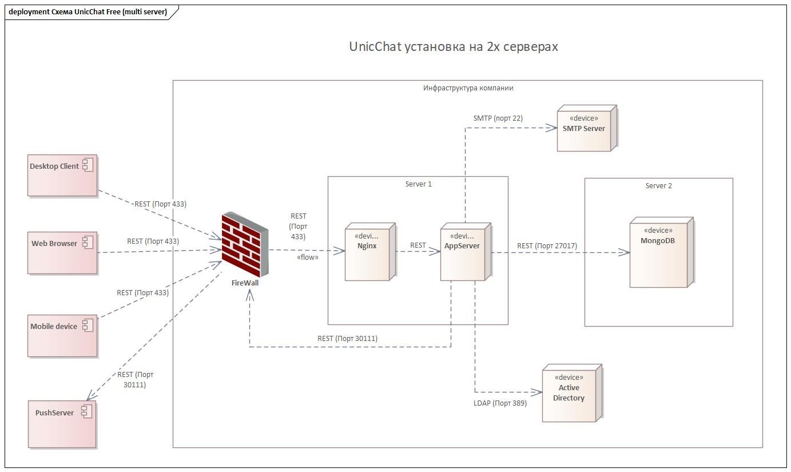

# Инструкция по установке корпоративного мессенджера для общения и командной работы UnicChat

###### Версия документа 2.0 (установка без скрипта, только docker compose)

## Архитектура установки

#### Установка на 1-м сервере

#### Установка на 2-x серверах


## 1. Подготовка окружения

#### Требования к конфигурации до 50 пользователей. Приложение и БД устанавливаются на 1-й виртуальной машине

##### Конфигурация виртуальной машины
```
CPU 4 cores 1.7ghz, с набором инструкций FMA3, SSE4.2, AVX 2.0;
RAM 16 Gb;
250 Gb HDD\SSD;
```
Для ОС Ubuntu 20+ предлагаем воспользоваться нашими краткими инструкциями. Для других ОС воспользуйтесь инструкциями, размещенными в сети Интернет.

##### Требования для установки
- Сервер на Linux (рекомендуется Ubuntu 20+/Debian)
- Docker Engine ≥ 20.10 с плагином `docker compose`
- git
- Доступ с правами root или через sudo
- Доменное имя, привязанное к IP-адресу вашего сервера


##### Установка Docker 
Установка производится за пределами инструкции


##### Проверка AVX на процессоре

```bash
grep -m1 avx /proc/cpuinfo && echo "AVX есть" || echo "AVX нет — используйте MongoDB 4.4"
```

Если AVX отсутствует, оставьте в `.env` образ `mongodb:4.4` (значение по умолчанию).

## 2. Установка UnicChat

### 2.1. Скачайте репозиторий

```bash
git clone https://github.com/unicommorg/unicchat.git
cd unicchat/single-server-install
```

### 2.2. Создайте и заполните .env

```bash
cp .env.example .env
vim .env   # или ваш редактор
```

Обязательно замените все `change_me_*` на собственные пароли.

**Важно:** пароли подставляются в строки подключения к MongoDB без URL-кодирования — используйте только латинские буквы, цифры, `_` и `-` (без `@ : / ? & %` и пробелов).

Ключевые переменные:

| Переменная | Назначение |
|---|---|
| `DOMAIN` | Домен сервера; `localhost` для локальной установки |
| `ROOT_URL` | **Публичный URL, как его видит браузер пользователя**: `https://ваш-домен` |
| `MONGODB_ROOT_PASSWORD` | Пароль root-пользователя MongoDB |
| `MONGODB_USERNAME` / `MONGODB_PASSWORD` / `MONGODB_DATABASE` | Учётные данные приложения в MongoDB |
| `LOGGER_DB_USER` / `LOGGER_DB_PASSWORD` / `LOGGER_DB_NAME` | Роль и база сервиса логирования в PostgreSQL |
| `VAULT_DB_USER` / `VAULT_DB_PASSWORD` / `VAULT_DB_NAME` | БД сервиса Vault |
| `TASKER_DB_USER` / `TASKER_DB_PASSWORD` / `TASKER_DB_NAME` | БД сервиса задач (используется в секрете Vault) |
| `IMAGE_*` | Образы контейнеров |

### 2.3. Аутентифицируйтесь в Yandex Container Registry

Образы лежат в Yandex Container Registry. Войдите в реестр (тот же токен, что в инструкции unicchat.enterprise):

```bash
docker login --username oauth \
  --password-stdin \
  cr.yandex <<< "y0__wgBEPrL67wHGMHdEyD7rJmMGCeDEOXSuqJalbFdb2Dgucs0mlmU"
```

### 2.4. Запустите установку

```bash
docker compose up -d
```

Compose сам выполняет все шаги:

1. создаёт сеть `unicchat-network`;
2. поднимает MongoDB и ждёт, пока она станет primary (healthcheck);
3. `mongo-users-init` — одноразовый сервис, создающий пользователей и базы в MongoDB для vault и tasker;
4. поднимает Vault и ждёт его готовности (healthcheck);
5. `vault-init` — одноразовый сервис, получающий токен Vault и создающий секрет `KBTConfigs`;
6. поднимает PostgreSQL для logger'а, а `logger-postgres-init` создаёт в нём роль и базу (хранилище logger'а — PostgreSQL: с MongoDB сервис стартует, но падает на записи);
7. `site-url-init` — одноразовый сервис, записывающий `ROOT_URL` в настройку `Site_Url` приложения (без этого клиентский JS обращается к адресу по умолчанию);
8. запускает appserver, logger и tasker.

Дождитесь завершения инициализации и проверьте статус:

```bash
docker compose ps                 # все сервисы healthy/running
docker compose logs mongo-users-init
docker compose logs vault-init
```

Единовременные сервисы (`mongo-users-init`, `vault-init`, `logger-postgres-init`, `site-url-init`) должны завершиться с кодом 0: их статус — `Exited (0)`.

### 2.5. Проверьте готовность

```bash
curl -s http://localhost:8080 | head
```

Откройте в браузере `http://localhost:8080` или `https://ваш-домен` (при настроенном nginx с SSL, см. 2.6).

### 2.6. Настройка Nginx с SSL (обязательно для production)

Nginx с SSL сертификатами от Let's Encrypt является обязательным компонентом для работы UnicChat в production:

1. Перейдите в директорию nginx:
   ```bash
   cd ../nginx
   chmod +x generate_ssl.sh
   ```
2. Создайте файл `unicchat_config.txt` в корне проекта с содержимым:
   ```
   DOMAIN=yourdomain.com
   EMAIL=your@email.com
   ```
3. Проверьте upstream в `nginx/config/nginx.conf.template` (`server 127.0.0.1:8080;`).
4. Запустите настройку:
   ```bash
   sudo ./generate_ssl.sh
   ```
   И в меню выберите `[1] Генерация SSL сертификата`.

Подробная документация — в `nginx/README.md`.

## Важные примечания
- Доменное имя должно иметь A-запись в DNS до запуска сервисов и до генерации SSL-сертификата.
- Для процессоров без AVX используется MongoDB 4.4.
- `.env` содержит пароли и не коммитится в репозиторий.
- После завершения установки UnicChat доступен по адресу `https://ваш-домен`.

## Управление установкой

```bash
cd single-server-install

# статус и логи
docker compose ps
docker compose logs -f unicchat.appserver

# перезапуск всех сервисов
docker compose restart

# пересоздание после изменения .env
docker compose up -d

# остановка
docker compose stop

# полное удаление контейнеров и данных (БД включительно!)
docker compose down -v
```

Повторный запуск инициализаторов безопасен: `mongo-users-init` обновляет
пароли существующих пользователей, `vault-init` пропускает создание
секрета, если `KBTConfigs` уже существует.

## Устранение проблем
- `docker compose ps` показывает `unhealthy` — смотрите логи соответствующего сервиса: `docker compose logs <имя>`.
- `mongo-users-init` завершился с ошибкой — проверьте `MONGODB_ROOT_PASSWORD` в `.env` и что в паролях нет символов вне `[A-Za-z0-9_-]`.
- `vault-init` завершился с ошибкой — проверьте, что сервис `unicchat.vault` в состоянии `healthy`: `docker compose ps unicchat.vault`.
- Если меняли пароли в `.env`, пересоздайте контейнеры: `docker compose up -d`. Пароли пользователей MongoDB обновятся автоматически при повторном запуске `mongo-users-init` (`docker compose up -d --force-recreate mongo-users-init`).

## 3. Создание пользователя-администратора
1. При первом запуске откроется форма создания администратора:
   
   * `Organization ID` — идентификатор вашей организации, используется для подключения к push-серверу. Для получения ID необходимо написать запрос с указанием значения в Organization Name на почту support@unic.chat;
   * `Full name` — имя пользователя, которое будет отображаться в чате;
   * `Username` — логин пользователя, который вы будете указывать для авторизации;
   * `Email` — действующая почта, используется для восстановления доступа;
   * `Password` — пароль вашего пользователя;
   * `Confirm your password` — подтверждение пароля;
2. После создания пользователя авторизуйтесь в веб-интерфейсе с использованием ранее указанных параметров.
3. Для включения пушей перейдите в раздел Администрирование — Push. Включите использование шлюза и укажите адрес шлюза `https://push1.unic.chat`.
4. Перейдите в раздел Администрирование — Organization, убедитесь, что поля заполнены в соответствии с п.1.
5. Настройка завершена.

## 4. Карта сетевых взаимодействий сервера

#### Входящие соединения на стороне сервера UnicChat:
Открыть порты:
- 8080/TCP — порт приложения UnicChat (используется для доступа к веб-интерфейсу);
- 27017/TCP — порт MongoDB (рекомендуется ограничить доступ только для внутренней сети).

#### Исходящие соединения на стороне сервера UnicChat:
* Открыть доступ для Push-шлюза:
  * 443/TCP, на хост `push1.unic.chat`;
* Открыть доступ для ВКС-сервера:
  * 443/TCP, на хост `lk-yc.unic.chat`;
  * 7880/TCP, 7881/TCP, 7882/UDP;
  * 5349/TCP, 3478/UDP;
  * (50000 — 60000)/UDP (диапазон этих портов может быть изменён при развертывании лицензионной версии непосредственно владельцем лицензии);
* Открыть доступ до внутренних ресурсов: LDAP, SMTP, DNS при необходимости использования этого функционала.

## Частые проблемы при установке
Раздел в наполнении.

## Клиентские приложения
* Репозитории клиентских приложений
* Android: https://play.google.com/store/apps/details?id=pro.unicomm.unic.chat&pcampaignid=web_share
* iOS: https://apps.apple.com/ru/app/unicchat/id1665533885
* Desktop: https://github.com/unicommorg/unic.chat.desktop.releases/releases
