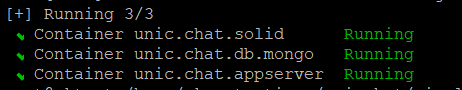

## Инструкция по установке корпоративного мессенджера для общения и командной работы UnicChat

###### версия 6-2.1.35, версия документа 1.7
### Оглавление 
<!-- TOC -->
  * [Инструкция по установке корпоративного мессенджера для общения и командной работы UnicChat](#инструкция-по-установке-корпоративного-мессенджера-для-общения-и-командной-работы-unicchat)
    * [Оглавление](#оглавление-)
    * [Архитектура установки](#архитектура-установки)
    * [Шаг 1. Подготовка окружения](#шаг-1-подготовка-окружения)
    * [Шаг 2. Клонирование репозитория](#шаг-2-клонирование-репозитория-)
    * [Шаг 3. Внешние зависимости](#шаг-3-внешние-зависимости)
    * [Шаг 4. Проверка версии mongodb](#шаг-4-проверка-версии-mongodb)
    * [Шаг 5. Запуск UnicСhat](#шаг-5-запуск-unicсhat)
    * [Шаг 6. Создание пользователя-администратора](#шаг-6-создание-пользователя-администратора)
    * [Шаг 7. Карта сетевых взаимодействий сервера](#шаг-7-карта-сетевых-взаимодействий-сервера-)
    * [Частые проблемы при установке](#частые-проблемы-при-установке)
    * [Клиентские приложения](#клиентские-приложения)
<!-- TOC -->

### Архитектура установки

___
#### Установка на 1-м сервере


### Шаг 1. Подготовка окружения

#### Требования к конфигурации до 50 пользователей. Приложение и БД устанавливаются на 1-й виртуальной машине

##### Конфигурация виртуальной машины

```
CPU 4 cores 1.7ghz, с набором инструкций FMA3, SSE4.2, AVX 2.0;
RAM 16 Gb;
250 Gb HDD\SSD;
```

### Шаг 2. Клонирование репозитория 
1. Выполните на сервере `git clone https://github.com/unicommorg/unicchat.git`

### Шаг 3. Внешние зависимости

На виртуальную машину установите `docker` и `docker-compose`, для этого воспользуйтесь инструкциями для вашей ОС, размещенными в сети Интернет.

### Шаг 4. Проверка версии mongodb

1. На виртуальной машине выполните команду `grep avx /proc/cpuinfo` или аналогичную для вашей ОС. 
   2. Если в ответе вы не видите AVX, то вам нужно
      в файле `./single_server_install/unicchat.yml` в строке
      `image: docker.io/bitnami/mongodb:${MONGODB_VERSION:-5.0}` отредактировать версию mongodb, указав ее ниже 5.0, 
      например, 4.4, `image: docker.io/bitnami/mongodb:${MONGODB_VERSION:-4.4}`
   3. Если AVX на вашем сервере поддерживается (в ответе есть строки с поддержкой AVX), то ничего дополнительно делать не нужно.

### Шаг 5. Запуск UnicСhat

1. Выполните авторизацию в docker для скачивания образов:
```shell
 sudo docker login \
  --username oauth \
  --password y0_AgAAAAB3muX6AATuwQAAAAEawLLRAAB9TQHeGyxGPZXkjVDHF1ZNJcV8UQ \
  cr.yandex
```
2. Перейдите в каталог `./single_server_install`
3. Запустить сервер, для этого выполните команду `docker compose -f unicchat.yml up -d`
4. Дождитесь пока будут загружены образы компонент, это может занять какое-то время. После загрузки, компоненты запустятся автоматически.
5. Успешный запуск компонент будет отображаться в терминале:
   
6. После запуска компонент, Unicchat будет доступен по адресу `http://localhost:8080`

### Шаг 6. Создание пользователя-администратора

1. При первом запуске откроется форма создания администратора 
* `Organization ID` - Идентификатор вашей организации, используется для подключения к push серверу. Может быть указан
  позже. Для получения ID необходимо написать запрос с указанием значения в Organization Name на почту
  support@unic.chat;
* `Full name` - Имя пользователя, которое будет отображаться в чате;
* `Username` - Логин пользователя, который вы будете указывать для авторизации;
* `Email` - Действующая почта, используется для восстановления доступа;
* `Password` - пароль вашего пользователя;
* `Confirm your password` - подтверждение пароля;

2. После создания пользователя, авторизоваться в веб-интерфейсе с использованием ранее указанных параметров.
3. Для включения пушей, перейти в раздел Администрирование - Push. Включить использование шлюза и указать адрес
   шлюза https://push1.unic.chat
4. Перейти в раздел Администрирование - Organization, убедиться что поля заполнены в соответствии с п.1
5. Настройка завершена.

### Шаг 7. Карта сетевых взаимодействий сервера 

#### Входящие соединения на стороне сервера UnicChat:

Открыть порты: 
 - 8080/TCP - по-умолчанию, сервер запускается на 8080 порту и доступен http://localhost:8080, где localhost - это IP адрес сервера UnicChat;
 - 443/TCP - порт будет нужен, если вы настроили nginx с сертификатом HTTPS;

#### Исходящие соединения на стороне сервера UnicChat:

* Открыть доступ для Push-шлюза:
  * 443/TCP, на хост **push1.unic.chat**;

* Открыть доступ для ВКС сервера:
  * 443/TCP, на хост **lk-yc.unic.chat**;
  * 7881/TCP, 7882/UDP
  * (50000 - 60000)/UDP (диапазон этих портов может быть измененён при развертывании лицензионной версии непосредственно владельцем лицензии)

* Открыть доступ до внутренних ресурсов: LDAP, SMTP, DNS при необходимости использования этого функционала

### Частые проблемы при установке
Раздел в наполнении.

### Клиентские приложения
* [Репозитории клиентских приложений]
* Android: (https://play.google.com/store/apps/details?id=pro.unicomm.unic.chat&pcampaignid=web_share)
* iOS: (https://apps.apple.com/ru/app/unicchat/id1665533885)
* Desktop:  (https://github.com/unicommorg/unic.chat.desktop.releases/releases)
